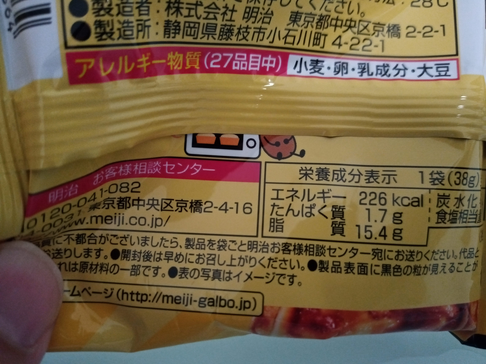

# RingFitAdventure  
2020年1月3日から、Nintendo Switch のリングフィットアドベンチャーに取り組みはじめました。  
環境構築、取り組み内容、私の体の変化について、記録していきます。[(記録はこちら。)](log202001.md)  
## 環境  
  1. Nintendo Switch （本体）  
これがないとはじまりません。買ってから驚いたのは、ネット接続が前提となっており、11a (5GHz)に対応、画面キャプチャもできて静止画または30秒の動画が撮れるので、ネットにアップしやすくなっています。  
動画から、静止画を切り出すことも、Switch 本体上でできてしまいます。すごい。
ちなみに、ジョイコンをリングに装着したり左太ももに巻いたりして使うので、ジョイコンの分離ができない廉価版の「スイッチライト」では遊べない。
  2. Ring Fit Adventure （ソフト＆リングコン＆レッグバンド）  
  ソフトはメモリカードのタイプ。本体の右肩のスロットに入れます。  
  マイクロSDカードは、本体ウラ面のスタンドの中のスロットに入れます。当座の使いみちとしては、本体に保存されていく画面キャプチャのデータをコピーして、外部に取り出すのに使います。本体でフォーマットができるので、手持ちのマイクロSDカードが使えました。
  3. エレコム HCS-WFS01WH （無線LAN 対応の体組成計）  
  体組成計なのですが、特徴として2.4GHz の無線LANに対応しています。自宅の無線LAN AP に接続すると、体重を計るたびにクラウド上にデータを飛ばして保存してくれるという素敵アイテム。いちいちスマホをかざすとかする必要がありません。  
  ただ最初の接続設定には苦労しました。スマホに専用アプリをインストールして初期設定するのですが、前段で「1.スマホの無線LANは2.4GHz 接続にする、2.GPS（位置情報）を有効にする。」の２点が必須なのですが、後者についてあまり説明がなく、GPS が無効だとAP名が「Unkown ssid」となってしまって、編集もできないので、接続がうまくいかず前述の２点に気づくまでかなり試行錯誤してしまいました。  
  クラウド上に保存されたデータは、アプリで同期ボタンを押すとグラフに反映されます。とても手軽かつモチベーション維持につながります。
## 取り決め  
  1. 1日３コース（目安として３０分ぐらい。）、とりあえず90日やる。
  2. 体重は朝起きてすぐ、用を足してから全裸で計る。体重管理アプリの画面をアップする。
  3. 食事は普通に食べる。ただしおかわり、大盛りはしない。
  4. 間食、カロリーのあるジュース、お酒は自分からは取らない。勧められたらそれは可。（飲み会等は可。ガムは可。）
  5. 食事以外の間食は、写真を撮ってアップする。可能であればカロリー併記。
  6. （目標は今年（2020年）１年で10kg減。  
## 直近の状況  
### 1/12 (DAY 09/90)  
|リングフィットアドベンチャー|
|:--:|
|土曜日だったので昼間にやったが、夜も気が向いたので、もう１回やった。クリアしたワールドもよくみると達成率が100%でなく、よくみるとコースはクリアしているものの街の人の依頼をクリアしていないのだったので、これをコツコツクリアしておいた。左下の活動時間の表示が、ZRボタンを押すといろいろ切り替えられることがわかった。|
||
|エレコム ECLEAR|
|200g増。昨日は１時間やったものの、昼ゴハンが外食でよく食べたのと、お菓子もそこそこつまんだので、想定の範囲内。たまにはいいだろう。体は引き続き軽い筋肉痛。回復日は設けなくていいのだろうか。ふと気づくと肩こりがまったくなくなっている。冬休みで回復したからかもしれないし、リングフィットのおかげかもしれない。いい傾向は続いている。|
||
|食べちゃった|
||
||
