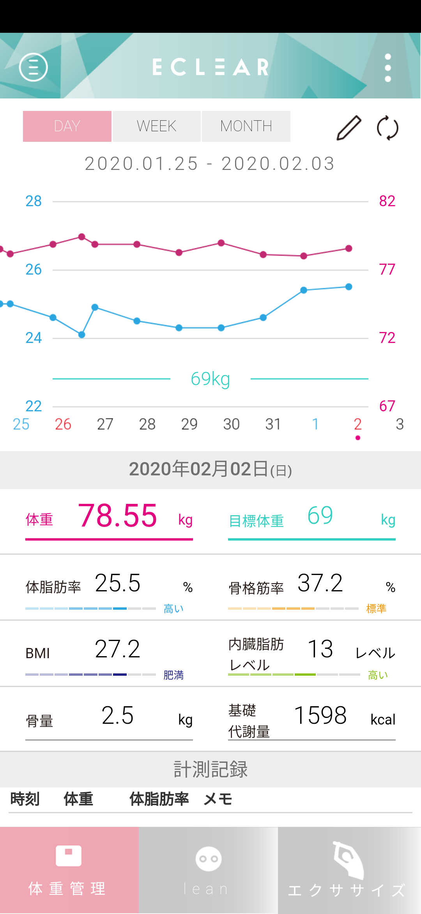

# Log  

2020年1月3日から、Nitendo Switch のリングフィットアドベンチャーに取り組みはじめました。  
運動ログの画面キャプチャと、体組成計のグラフをロギングしていきたいと思います。  

[2020年1月](log202001.md)  

2020年|2月
--|--
リングフィットアドベンチャー|エレコム ECLEAR
30日目。なんとか、今日まで1日も休まずやれている。土曜だが外出したりして時間が取れず、昼の合間に時間をみつけてやった。夜にももう１度やろうかと思ったが、意外と効いていて眠くてしかたなくなり、寝てしまった。ちゃんと効いている。|外出したり、昼にリングフィットしたり、それなりに負荷はかけたと思うが、夜はひさしぶりに焼き肉だった。たまにはね、と生ビールも１杯。お腹いっぱい食べたので、やはりちょっとぶり返し。しかし思ったほどの戻り幅ではなかった。

2020年|2月
--|--
リングフィットアドベンチャー|エレコム ECLEAR
|