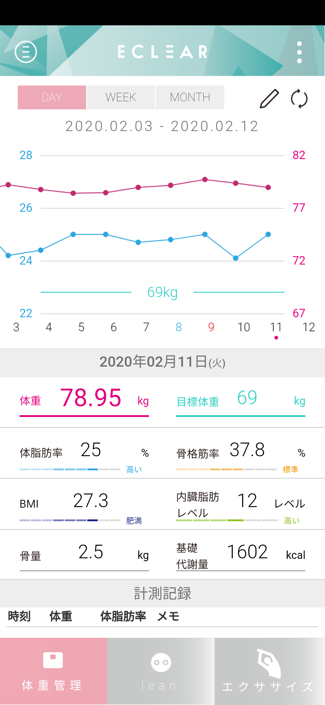
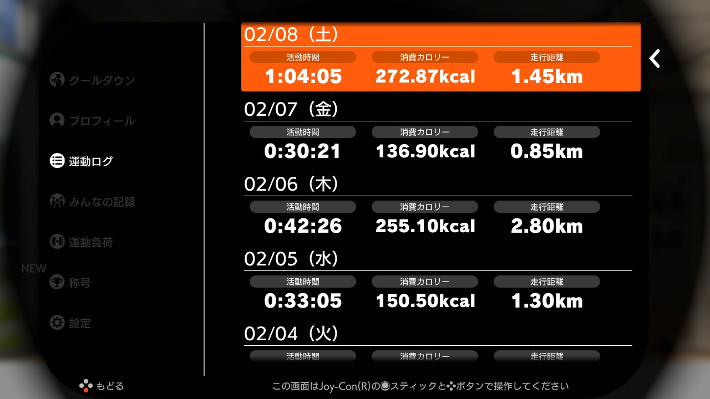
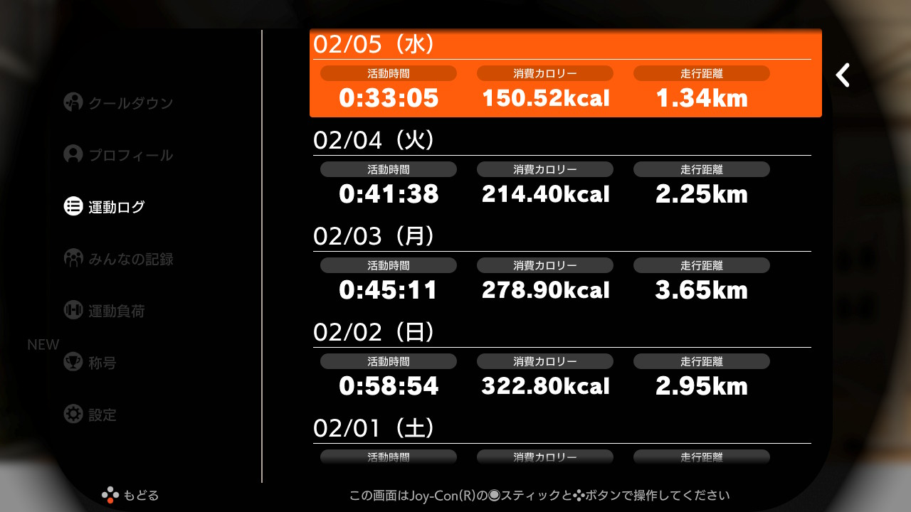
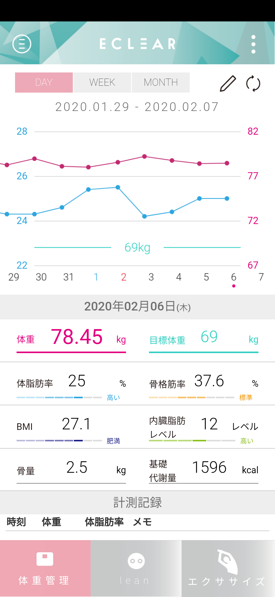
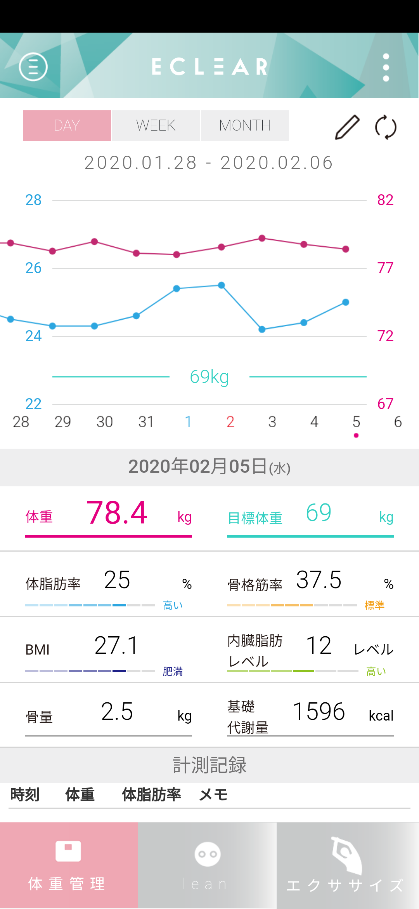
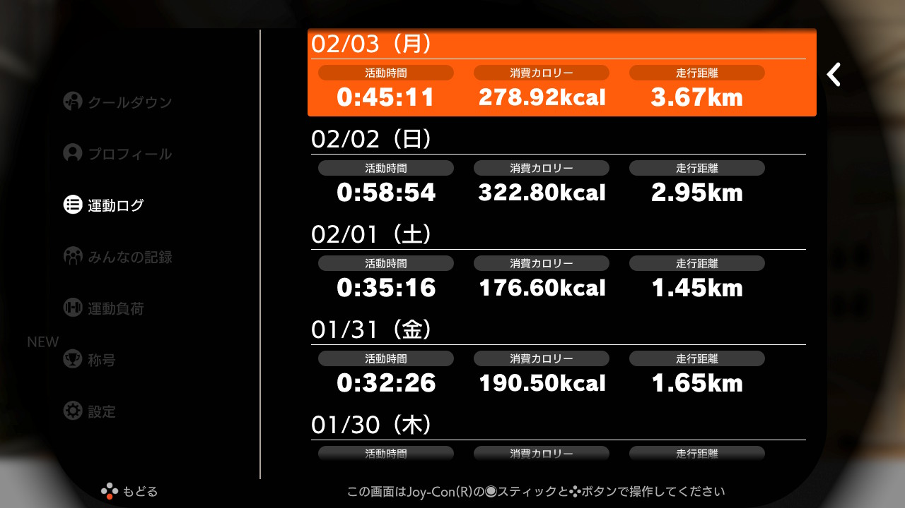
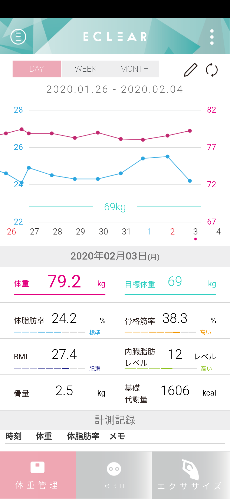

# Log  

2020年1月3日から、Nitendo Switch のリングフィットアドベンチャーに取り組みはじめました。  
運動ログの画面キャプチャと、体組成計のグラフをロギングしていきたいと思います。  

[2020年1月](log202001.md)  

2020年|2月
--|--
リングフィットアドベンチャー|エレコム ECLEAR
DAY 41/90|2020/02/12  
今日もぎっくり腰のためおやすみ。|なんともとの体重に近くなってしまった。自制しなければ。
DAY 40/90|2020/02/11  
ぎっくり腰になってしまい、はじめておやすみ。|立てないため測れず。
DAY 39/90|2020/02/10  
時間はそこそこ、軽めにやったが、強度を上げてあるからか、そこそこの消費カロリー。これ以上のプレイ時間を確保するのは無理。|土曜の飲み会のリバウンドを徐々に解消中。胸や腕の筋肉が発達してきた。
DAY 38/90|2020/02/09  
日曜だったので、午前と夜の２回やった。活動時間で２時間以上、実際には３時間ぐらいやった。BESTの出し方がわかってきた。髪が燃える状態まで一気にフォームを固めれば、あとはそれ以上ちからを振り絞らなくてもいいようだ。７〜８割でコンスタントにやる、という感じになってきた。サボる、ちからを抜く、というのともちょっと違う、正しいフォームでやれるようになってきた感覚がある。ワールド２１に到達したが、そろそろ１周目が終わるのかも。|しっかり動いたので絞れたかと思ったが、体重はそれほどでもなかった。しかし体脂肪率は落ちている。鏡を見るとウエストがかなり絞れてきた。他人に気づかれるのは３ヶ月目ぐらい、とよく言われるから、まだ半分にもなっていない。
DAY 37/90|2020/02/08  
土曜だったのでしっかりめ。強度を上げたので、けっこうヘトヘトになった。無意識に楽をしようと体がブレーキをかけるのを、リングさんの励ましで奮い立たせてちからを振り絞っている。|飲み会があり、体重が大きく戻ってしまった。しかたない・・・
DAY 36/90|2020/02/07  
運動強度を２５にしたところ、ちょうどいい、よりも少しキツい、ぐらい。始めた頃のように、ひぃひぃ言いながらやる状態になった。それぐらいでいいのだろう。フォームが小さくなってくると、Best判定が出なかったり、「キープして！」とか言われるので、サボれないのもいい。無意識にブレーキをかけるのを乗り越えてちからを振り絞っている感じ。|ちょっとお菓子を食べすぎたか。減っていると思ったら増えていた。しかしお腹まわりはどんどんスッキリしてきている。２ヶ月目の体重はどうなっているだろう。
DAY 35/90|2020/02/06  
始める前に強度を上げるか聞かれて、強めるように答えると３上げることになって、27になった。やってみたら、ちょっと上げすぎだったので、２５にしてみた。テンポは悪くなく、ちょっとキツイかな・・・というぐらいの、ちょうどいいぐらいになった。|強度を調節したからか、晩ごはんが辛かったからか、喉が乾いて水をガブガブ飲んだ。久しぶりに寝ていて感じるほどの筋肉疲労もあった。絞れている感覚はあるのだけど、計るとちょっと増えていた。とりあえず体重よりもお腹のお肉がなくなることを目指そう。
DAY 34/90|2020/02/05  
運動強度について、これまで２２だったが、運動後の振り返りで「長時間やってるみたいだけど、運動強度が足りてないのでは？」みたいなことを言われたので、試しに最大の３０にしてみたところ、バトルがめちゃくちゃ長くなって、ゲームとしての展開のテンポが悪くなってしまった。「再設定」で問診をやりなおし、強度が強くなるように回答したところ、２４になったので、それでやってみると、ちょうどよかった。ワールドを１周目全制覇するまでは、これで行こうと思う。|引き続き体重の変化はあまりなくなったが、鏡をみると、ちょっと腹筋の形が出てきた。強度もちょっと上げたので、追い込みたい。お腹のお肉がつっかえなくなったからか、前屈で楽に手が地面につくようになってきた。こういう変化もうれしい。左足の甲が痛いのも、ちょっとマシになってきた。
DAY 33/90|2020/02/04  
|運動強度２２だが、最大３０まで上げられるらしい。ミブリさんに「運動時間が長いけど、強度が足りてないのでは」みたいなことを言われた。筋肉痛も一段落してきたので、徐々に運動強度を上げてもいいかもしれない。短時間で汗だくになればそれはそれでいいかもしれない。|腹回りは本当に締まった感覚がある。体重はそうでもないが体脂肪は順調に下がっている。左足の甲が痛くて運動強度を上げるのを控えていたが、だいぶ痛くなくなってきたので、思い切って運動強度を上げてみようかな。
DAY 32/90|2020/02/03  
平日は、夜帰ってきて、家事をしてリングフィットやって、風呂入ってギターの練習して寝る、という生活。家帰ってきてからがなかなか忙しい。これだけの濃度をジム通いではできないだろう。自宅で、自重トレを、これだけ続けられるという仕掛けは、すごい。|腹回り、ぜい肉は残っているものの、その下にある筋肉が締まってきて、体の変化を感じる。ズボンのウエストもちょっとゆるくなってきたように思う。体幹が強くなってきたのと柔軟性があがったのも感じる。日常生活動作が楽にできるようになってきた。
DAY 31/90|2020/02/02
日曜日だったので昼間にしっかりがんばった。比較的楽なフィットスキルを選んでしまいがちだけども、それでもラッシュとかが強制的にあるのでトータルで強度は充分になったと思う。|晩ごはんが海自カレーでたくさん食べたからかな・・・しかし体脂肪率は下がっているし、一時的なぶり返しだろう。
DAY 30/90|2020/02/01
30日目。なんとか、今日まで1日も休まずやれている。土曜だが外出したりして時間が取れず、昼の合間に時間をみつけてやった。夜にももう１度やろうかと思ったが、意外と効いていて眠くてしかたなくなり、寝てしまった。ちゃんと効いている。|外出したり、昼にリングフィットしたり、それなりに負荷はかけたと思うが、夜はひさしぶりに焼き肉だった。たまにはね、と生ビールも１杯。お腹いっぱい食べたので、やはりちょっとぶり返し。しかし思ったほどの戻り幅ではなかった。

2020年|2月
--|--
リングフィットアドベンチャー|エレコム ECLEAR
 おやすみ　|
|
|
|
|
|
|
|
|
|
|