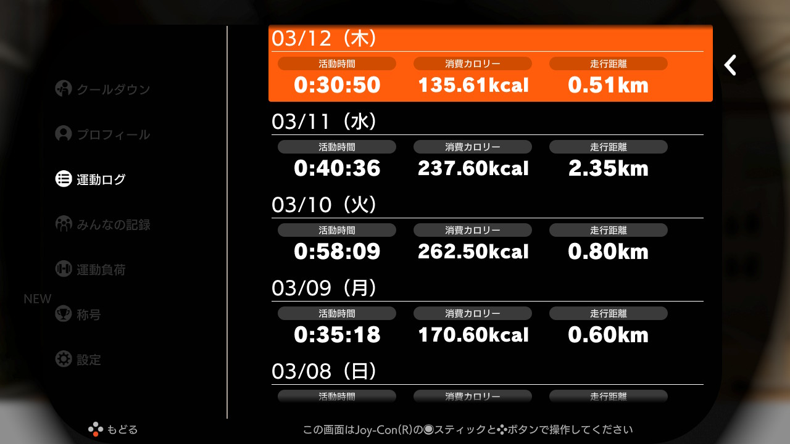
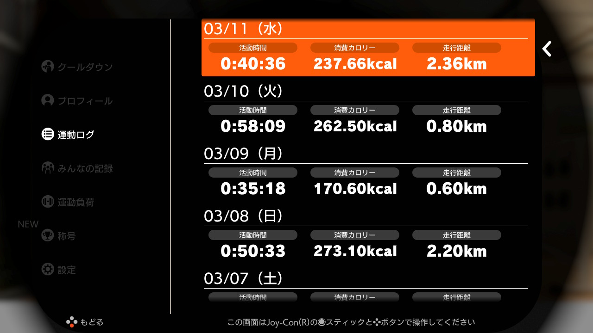
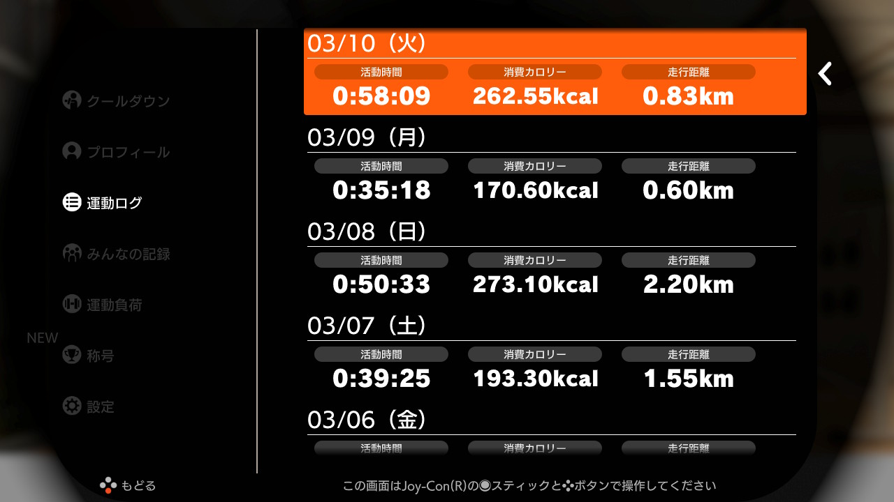
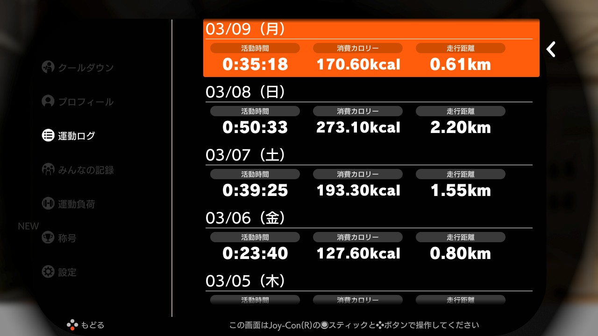

# Log  

2020年1月3日から、Nitendo Switch のリングフィットアドベンチャーに取り組みはじめました。  
運動ログの画面キャプチャと、体組成計のグラフをロギングしていきたいと思います。  

[2020年1月](log202001.md)  
[2020年2月](log202002.md)  

2020年|3月
--|--
リングフィットアドベンチャー|エレコム ECLEAR
DAY 70/90|2020/03/12
かなりキツかったが、走行距離がないステージが多かったからか、消費カロリーはそうでもなかった。コースを規定の歩数以下でゴールする、とか、縛りのあるステージがいちばん脈が上がるかもしれない。|微増が続いている。あと２０日でどうなるか・・・
DAY 69/90|2020/03/11| 
スクワットやもも上げ、マウンテンクライマーを頑張った。運動負荷30にもだいぶ慣れてきた。キツいはキツいのだけども。|体重減ってるんじゃないかと思ったがそうでもなかった。間食はだいぶ減らせていると思うので、食事を少し控えてみようかな。
DAY 68/90|2020/03/10
意識的に脈拍が上がるフィットスキルをやろうとしているが、後半バテてくると楽めなのを選んでしまう。追い込むのは難しい。|一進一退・・・かつての筋肉痛というほどではないが、筋肉の疲労感はあり、脂肪燃焼している感覚はある。９０日でガクンと減量は無理っぽいが、１年続ければ相当引き締まるだろう。
DAY 67/90|2020/03/09 
いちばんキツいフィットスキルといえばマウンテンクライマーだけど、毎日２回から３回ぐらいやるようにしている。最初は足は動かないし、休み休みだったけど、だんだん軽やかにできるようになってきた。|お肉はまだまだ掴めるな・・・がんばろう。
DAY 66/90|2020/03/08 
そこそこ頑張ったが、セットするフィットスキルの選択は大事だな、と思うなど。攻撃力の高い全体攻撃を選んでしまうと、かけたい負荷とは違うなぁ、という感じ。スクワット系、ももあげ系、腹筋系を重点的にセットしたい。|横ばい。（微増）割とよく飲食したので、いいのだけど、改めて節制を考えないと。９０日過ぎたらプロテインをやめてアミノ酸に切り替えようかな。
DAY 65/90|2020/03/07  
短い時間でヘトヘトになるまで追い込めている。何もなしでやれば20回ぐらいでやめそうな運動を、40回とかやらされるので、かなり負荷はかけられていると思う。掴める量も減ってきた気がする。|だいたい維持。
DAY 64/90|2020/03/06  
今日はあっさりめ。|体脂肪率、ちゃんと計れているのかな・・・
DAY 63/90|2020/03/05  
セットするフィットスキルを、効率よく魔物を倒せるものから、脈拍が上がりそうなものに切り替えてやっている。マウンテンクライマーを３回やったりしたのでかなり追い込めた。|昨日は昼夜と外食だったが、リバウンドしてなくてよかった。９０日過ぎたら、プロテイン飲むのをやめてみてもいいかもしれない。
DAY 62/90|2020/03/04
コンパクトにぎゅっと運動。フィットスキルによっては、25回キープ、15回ペースアップというのがあって、20回目ぐらいでへたばってるのにそこからさらに20回とかペースアップとかやるのだけど、これ、なんとなく自分ひとりでやってたら、とてもじゃないけどそこまで追い込めない。時間確保の面でも、これ以上効率的に継続可能なもの、というのはちょっと思いつかない。|お腹周りは自分ではかなりスッキリしてきて満足しているが、なぜか体重は一進一退が続いている。疲労回復目的もあって減量用プロテインをしっかり飲んでいるのだけど、筋肉がしっかりついているからかもしれない。絞れているのでよしとする。とにかく90日間は完走しよう。
DAY 61/90|2020/03/03
フィットスキルのうちで一番キツいのがマウンテンクライマーだが、意識して２回ぐらいやるようにしている。だんだんできるようになっていく感じがある。続けよう。|お腹周りのぜい肉が減ってきた感があるのだが、体重としてはそれほどでもない。まだまだ掴めるので、節制は続ける。
DAY 60/90|2020/03/02
運動負荷30（最大）にもだいぶ慣れてきた。９０日まであと３０日となったので、このペースで行きたい。体は確実に絞れてきてるし、日常生活動作でも体幹の安定が増している。習慣化もできているけども、改めて、頑張ろう。|体重が全然落ちないが、体は絞れている。あとは食べる量かな？脂肪が減って筋肉が増えているというのはあると思うが。
DAY 59/90|2020/03/01
日曜日なので２回にわけて、しっかりやった。それでもさほど筋肉痛にはならず。だいぶ体が慣れてきたのかな。ひとまずの目標である９０日の２／３まで来た。ここからもっと追い込んだほうがいいんだろうなぁ・・・|体重戻ってきた。嫌や・・・

2020年|3月
--|--
リングフィットアドベンチャー|エレコム ECLEAR
|
|
|
|
|
|
|なし
|
|
|
|
|
