# Log  

2020年1月3日から、Nitendo Switch のリングフィットアドベンチャーに取り組みはじめました。  
運動ログの画面キャプチャと、体組成計のグラフをロギングしていきたいと思います。  

[2020年1月](log202001.md)  

2020年|2月
--|--
リングフィットアドベンチャー|エレコム ECLEAR
DAY 54/90|2020/02/25
１周目の積み残しミッションを100％こなすのは無理、と思ったので諦めて、エキストラワールドを淡々と進めることに。運動負荷を30（最大）にしたので、ひとつひとつのフィットスキルを嫌というほどやらされて、短い時間でかなり追い込める感じに。軽い筋肉痛になっている。ストーリーモードだけじゃなく、カスタムをやってもいいかもしれない。９０日やりきったら、ジョギングとかを併用してもいいかもしれない。|お菓子を食べすぎた。反省。でもまあたまにはそういう時もあるか。
DAY 53/90|2020/02/24
２周目ではなく、１周目の積み残しミッションをこなす。しかし積み残しているだけあって、何回やってもクリアできないものが大半。１周目全ワールド達成率100％を目指したけど、これ絶対ムリだな・・・|祝日でお昼が外食で食べすぎた。如実に反映されるなぁ。
DAY 52/90|2020/02/23  
今日は２周目ではなく、１周目のやり残しミッションを潰していくなど。しかし、苦手なミニゲームとかだけが残っているため、やっぱり諦めたものもいくつか。全ワールド100％達成、というのはちょっと無理かもしれない。|昨日はちょっと食べすぎたかな。たまには。フィットネスを続けよう。
DAY 50/90|2020/02/21  
クリア後のワールドがどういうことなのか、ちょっとわかってきた。３周目はどうなるのかな？クリア後にウェア一式をもらえることがあるけど、次のワールドに行くとあっさりともっと高性能なウェアが売っているのずっこけるな・・・|体重いい感じに減ってきた。運動強度とか、食事を気をつけないと継続して落とせなさそうな予感。もしくは、とにかく筋肉をつければ体重はさておき引き締まる、ということもあるかもしれない。いや、軽くなりたいんだけど。
DAY 49/90|2020/02/20
昨日ゲームクリアしたので、今日は軽め。ミッションが発生していたので、それをこなすなどした。クリアすると、ワールドが増えるようだが、自動で進むのではなく、選ばないといけないようだ。また、ラスボス戦は何度でもできるようだ。あと、カスタムモードで脂肪燃焼のセットをこなすのもよいかもしれない。|体重微増。昨日ちょっとお菓子を食べたが、たまにはいいよね。
DAY 48/90|2020/02/19
今日でゲームクリアーした。総消費カロリー10453.24kcal とのこと。よく頑張った。２周目はステージが増えたりするらしく、続けるための工夫もしてあるようだ。カスタムモードで有酸素運動系ばかりやってもいいかもしれない。|体重はそのままだが体脂肪率が上がるという結果。誤作動な気もするが、気にせずトレーニングを続けよう。
DAY 47/90|2020/02/18
最終ワールドの１面をラスボスを残して終わらせ、２面をこなす作業。もっとやりたかったが時間切れ。|体重がようやく78kgを切って77.9kgとなった。リングフィットを始めてから、一度77.9kgまで落ちてから、また戻ったりしてなかなか落ちてこなかったが、ようやくまた落ちてきた。なにより、鏡をみると、引き締まってきたのがわかる。まだまだ「肥満」ゾーンでお肉もつかめてしまうが、この調子で頑張ろう。
DAY 46/90|2020/02/17
最終ワールド、短いのかと思ったら２画面あってステージがいっぱいあった。３、４日はかかりそう。マウンテンクライマーが、始めた頃は全然できなかったが、だんだんできるようになってきた。片足立ちでふらつかないなど、体幹も強くなってきている。|体重、体脂肪率ともに一進一退。思ったほど落ちてこないなぁ。第一目標の９０日まで折り返したが、どうなるやら。
DAY 45/90|2020/02/16
いよいよ最後のワールドに突入、というところで終了。レベルも２００を超えた。そういえば、ヘトヘトになるほどやっているものの、筋肉痛や筋肉疲労にならなくなってきた。BESTになる最低限の強さでやるようになって、無意識にブレーキをかけて全力ではなくなっているのもあるかもしれない。２周目はそのへんのバランスの模索かな。|体重はあいかわらず。しかし、子どもたちが「パパ痩せてきた！」と太鼓判を押してくれた。まだまだぜい肉はつかめるほどついているが、その下に固い筋肉が発達してきている。そういえばとりあえず９０日やろう、と始めたが今日で半分、折返しだ。がんばろう。
DAY 44/90|2020/02/15
土曜日なのでしっかり。あとワールドが１つだけなので、いまのワールドを終わらせたかったが、時間切れ。|お昼ごはん、晩ごはん、食べすぎたかな？
DAY 43/90|2020/02/14
腰をいたわりながら、すこし軽めにこなした。ストレス発散にもなっている。|リバウンドが解消してきた。ふくらはぎの筋肉がかなり発達してきた。体重はそれほど変わっていないけれども、脂肪と筋肉が入れ替わっていっているのを感じる。
DAY 42/90|2020/02/13  
ぎっくり腰で２日おやすみしたあと、おそるおそる、様子を見ながらのトレーニング。特に痛いことはなかった。ワールド２１をクリアして、あと残すは２つのようだ。２周目はどのように進むのか。強度を上げてじっくりやろうと思っている。|一進一退が続く。ぎっくり腰が落ち着いたら、強度をもうちょっと上げて頑張ってみるかな・・・
DAY 41/90|2020/02/12  
今日もぎっくり腰のためおやすみ。|なんともとの体重に近くなってしまった。自制しなければ。
DAY 40/90|2020/02/11  
ぎっくり腰になってしまい、はじめておやすみ。|立てないため測れず。
DAY 39/90|2020/02/10  
時間はそこそこ、軽めにやったが、強度を上げてあるからか、そこそこの消費カロリー。これ以上のプレイ時間を確保するのは無理。|土曜の飲み会のリバウンドを徐々に解消中。胸や腕の筋肉が発達してきた。
DAY 38/90|2020/02/09  
日曜だったので、午前と夜の２回やった。活動時間で２時間以上、実際には３時間ぐらいやった。BESTの出し方がわかってきた。髪が燃える状態まで一気にフォームを固めれば、あとはそれ以上ちからを振り絞らなくてもいいようだ。７〜８割でコンスタントにやる、という感じになってきた。サボる、ちからを抜く、というのともちょっと違う、正しいフォームでやれるようになってきた感覚がある。ワールド２１に到達したが、そろそろ１周目が終わるのかも。|しっかり動いたので絞れたかと思ったが、体重はそれほどでもなかった。しかし体脂肪率は落ちている。鏡を見るとウエストがかなり絞れてきた。他人に気づかれるのは３ヶ月目ぐらい、とよく言われるから、まだ半分にもなっていない。
DAY 37/90|2020/02/08  
土曜だったのでしっかりめ。強度を上げたので、けっこうヘトヘトになった。無意識に楽をしようと体がブレーキをかけるのを、リングさんの励ましで奮い立たせてちからを振り絞っている。|飲み会があり、体重が大きく戻ってしまった。しかたない・・・
DAY 36/90|2020/02/07  
運動強度を２５にしたところ、ちょうどいい、よりも少しキツい、ぐらい。始めた頃のように、ひぃひぃ言いながらやる状態になった。それぐらいでいいのだろう。フォームが小さくなってくると、Best判定が出なかったり、「キープして！」とか言われるので、サボれないのもいい。無意識にブレーキをかけるのを乗り越えてちからを振り絞っている感じ。|ちょっとお菓子を食べすぎたか。減っていると思ったら増えていた。しかしお腹まわりはどんどんスッキリしてきている。２ヶ月目の体重はどうなっているだろう。
DAY 35/90|2020/02/06  
始める前に強度を上げるか聞かれて、強めるように答えると３上げることになって、27になった。やってみたら、ちょっと上げすぎだったので、２５にしてみた。テンポは悪くなく、ちょっとキツイかな・・・というぐらいの、ちょうどいいぐらいになった。|強度を調節したからか、晩ごはんが辛かったからか、喉が乾いて水をガブガブ飲んだ。久しぶりに寝ていて感じるほどの筋肉疲労もあった。絞れている感覚はあるのだけど、計るとちょっと増えていた。とりあえず体重よりもお腹のお肉がなくなることを目指そう。
DAY 34/90|2020/02/05  
運動強度について、これまで２２だったが、運動後の振り返りで「長時間やってるみたいだけど、運動強度が足りてないのでは？」みたいなことを言われたので、試しに最大の３０にしてみたところ、バトルがめちゃくちゃ長くなって、ゲームとしての展開のテンポが悪くなってしまった。「再設定」で問診をやりなおし、強度が強くなるように回答したところ、２４になったので、それでやってみると、ちょうどよかった。ワールドを１周目全制覇するまでは、これで行こうと思う。|引き続き体重の変化はあまりなくなったが、鏡をみると、ちょっと腹筋の形が出てきた。強度もちょっと上げたので、追い込みたい。お腹のお肉がつっかえなくなったからか、前屈で楽に手が地面につくようになってきた。こういう変化もうれしい。左足の甲が痛いのも、ちょっとマシになってきた。
DAY 33/90|2020/02/04  
|運動強度２２だが、最大３０まで上げられるらしい。ミブリさんに「運動時間が長いけど、強度が足りてないのでは」みたいなことを言われた。筋肉痛も一段落してきたので、徐々に運動強度を上げてもいいかもしれない。短時間で汗だくになればそれはそれでいいかもしれない。|腹回りは本当に締まった感覚がある。体重はそうでもないが体脂肪は順調に下がっている。左足の甲が痛くて運動強度を上げるのを控えていたが、だいぶ痛くなくなってきたので、思い切って運動強度を上げてみようかな。
DAY 32/90|2020/02/03  
平日は、夜帰ってきて、家事をしてリングフィットやって、風呂入ってギターの練習して寝る、という生活。家帰ってきてからがなかなか忙しい。これだけの濃度をジム通いではできないだろう。自宅で、自重トレを、これだけ続けられるという仕掛けは、すごい。|腹回り、ぜい肉は残っているものの、その下にある筋肉が締まってきて、体の変化を感じる。ズボンのウエストもちょっとゆるくなってきたように思う。体幹が強くなってきたのと柔軟性があがったのも感じる。日常生活動作が楽にできるようになってきた。
DAY 31/90|2020/02/02
日曜日だったので昼間にしっかりがんばった。比較的楽なフィットスキルを選んでしまいがちだけども、それでもラッシュとかが強制的にあるのでトータルで強度は充分になったと思う。|晩ごはんが海自カレーでたくさん食べたからかな・・・しかし体脂肪率は下がっているし、一時的なぶり返しだろう。
DAY 30/90|2020/02/01
30日目。なんとか、今日まで1日も休まずやれている。土曜だが外出したりして時間が取れず、昼の合間に時間をみつけてやった。夜にももう１度やろうかと思ったが、意外と効いていて眠くてしかたなくなり、寝てしまった。ちゃんと効いている。|外出したり、昼にリングフィットしたり、それなりに負荷はかけたと思うが、夜はひさしぶりに焼き肉だった。たまにはね、と生ビールも１杯。お腹いっぱい食べたので、やはりちょっとぶり返し。しかし思ったほどの戻り幅ではなかった。

2020年|2月
--|--
リングフィットアドベンチャー|エレコム ECLEAR
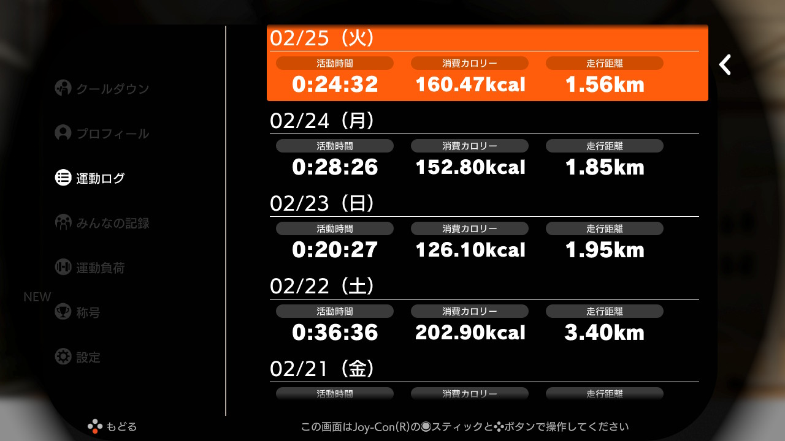|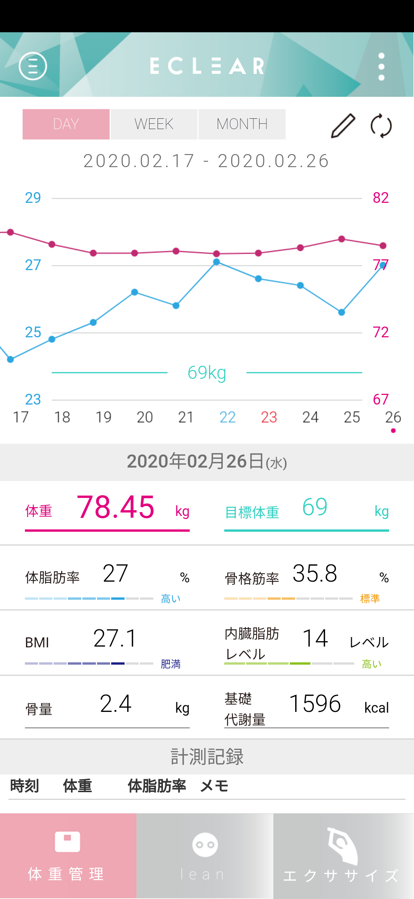
|
|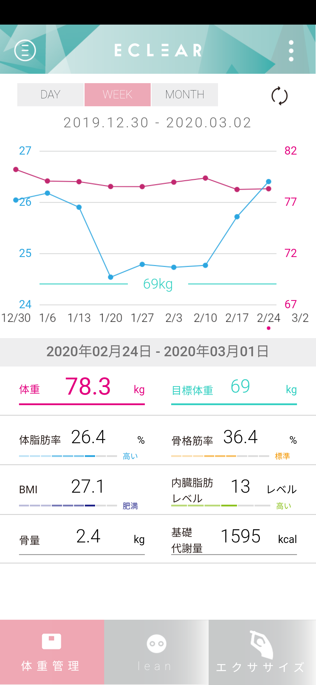
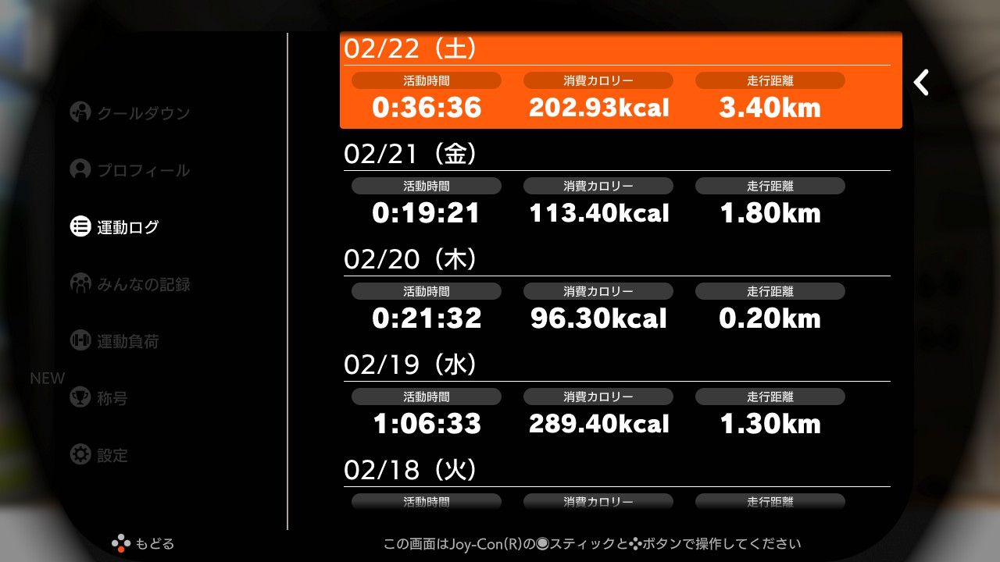|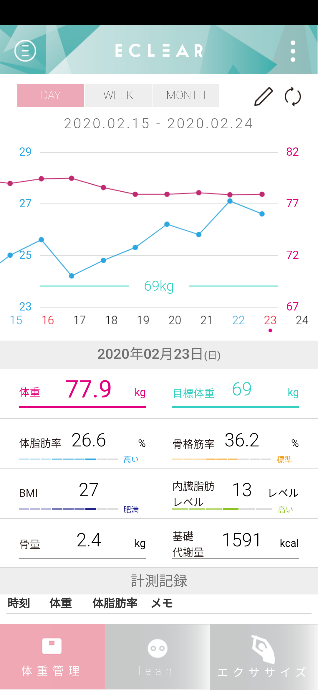
|
  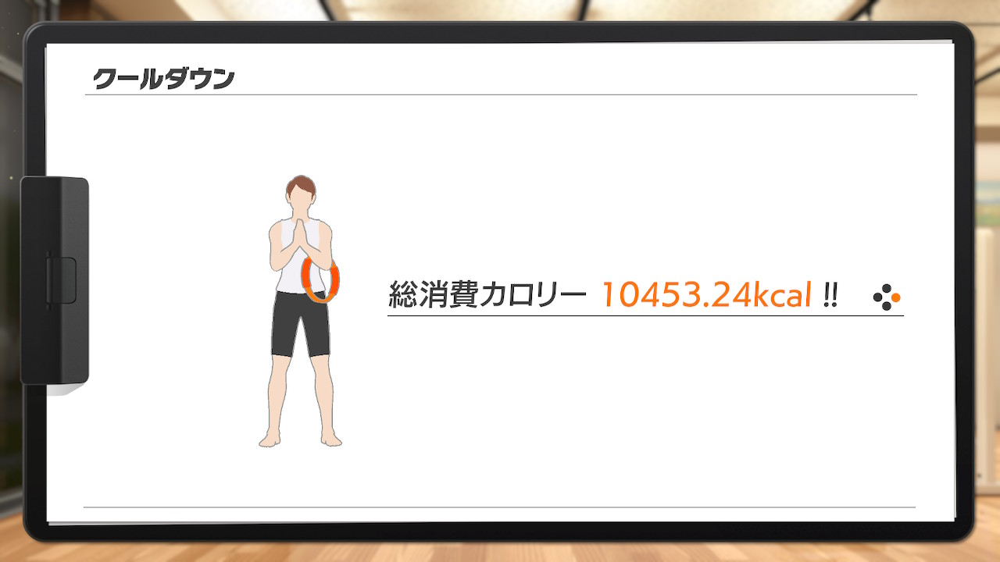|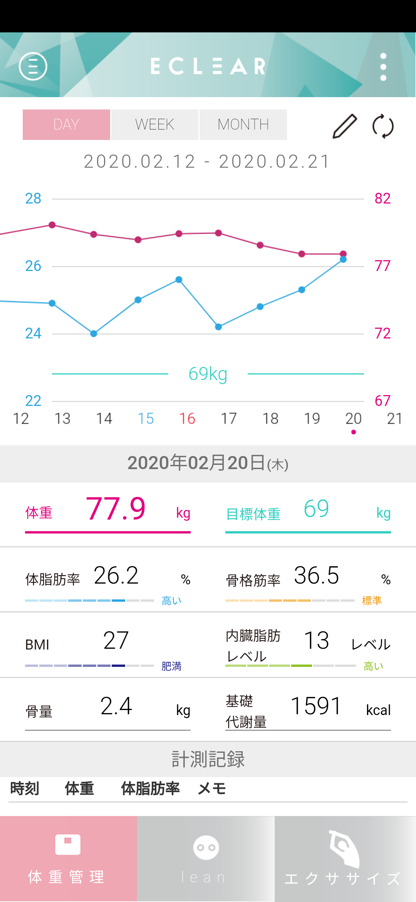
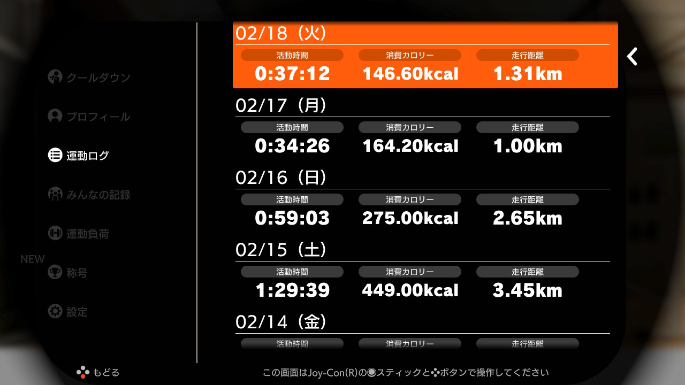|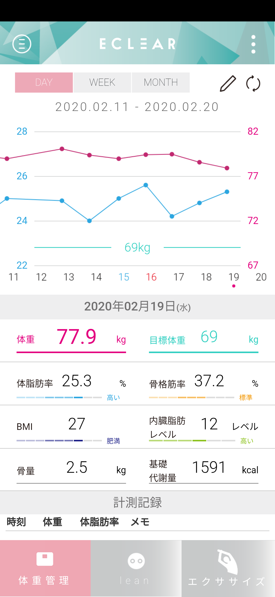
|
|
|
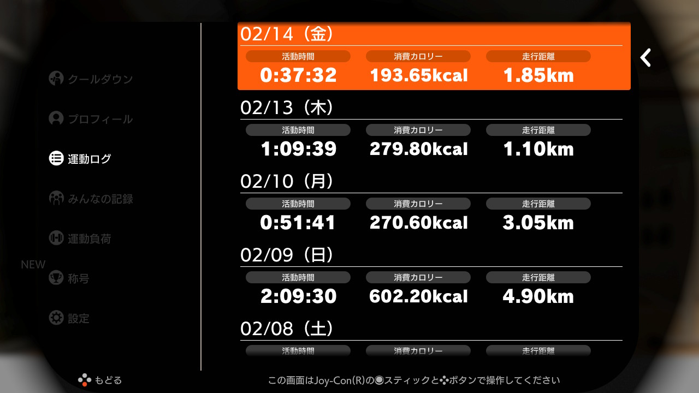|
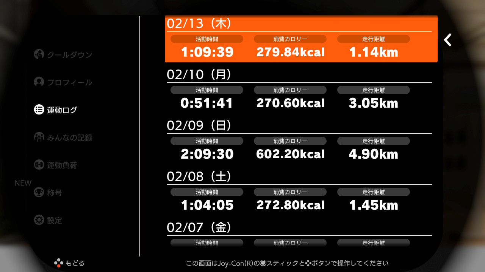|
 おやすみ　|
|
|
|
|
|
|
|
|
|
|