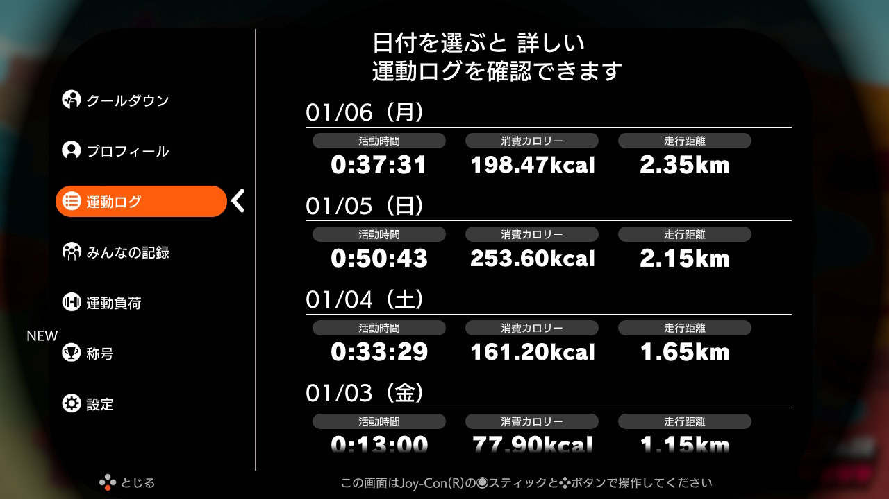

# Log 2020/01  

2020年1月3日から、Nitendo Switch のリングフィットアドベンチャーに取り組みはじめました。  
ステージクリアの画面キャプチャと、体組成計のグラフをロギングしていきたいと思います。  
## １月  
### 1/3 (DAY 01/90)  
|リングフィットアドベンチャー|
|:--:|
|キャプチャしたつもりが撮れていませんでした。なかなか楽しい。|
|image not available|
|エレコム ECLEAR|
|80kg を超えており自分でびっくり。|
||
### 1/4 (DAY 02/90)  
|リングフィットアドベンチャー|
|:--:|
|いちびってたら強度を４上げられました。|
||
|エレコム ECLEAR|
|起き抜けは80kg を切っていたものの、食べて飲んだら揺り戻し。じっくり行こう。|
||
### 1/5 (DAY 03/90)  
|リングフィットアドベンチャー|
|:--:|
|汗をかくので、入浴後は無理。夕食後すぐもつらい。いつやるか問題。しかし、とりあえず90日間、と思って１日１ワールドやっているが、長すぎな気がする。途中で何度か「今日はこれぐらいにしておきますか？」と聞かれるのだけど、そこでやめるのが適正な気もする。|
||
|エレコム ECLEAR|
|なんとか80kg を切った。いやいや、一時的に水分が抜けただけ。|
||
### 1/6 (DAY 04/90)  
|リングフィットアドベンチャー|
|:--:|
|１日１ワールドだとちょっとオーバーワークだったので、３０分超えて最初の「今日はこれぐらいにしておきますか？」で終わることにした。生活のなかで時間の確保も課題だ。|
||
||
|エレコム ECLEAR|
|スクワットが効いて、ももに疲労が残っている感じ。しかし嫌な感覚ではなく、スイッチが入ってエンジンがかかって体が燃えてるように感じる。|
||
### / (DAY /90)  
|リングフィットアドベンチャー|
|:--:|
||
||
|エレコム ECLEAR|
||
||

