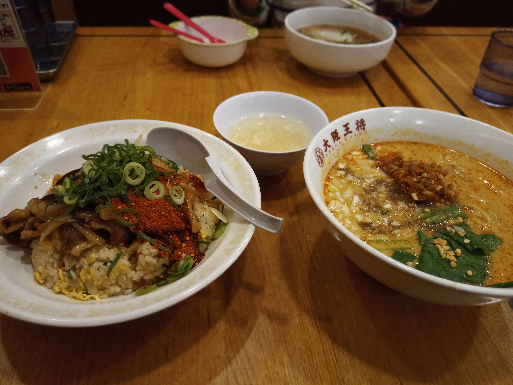
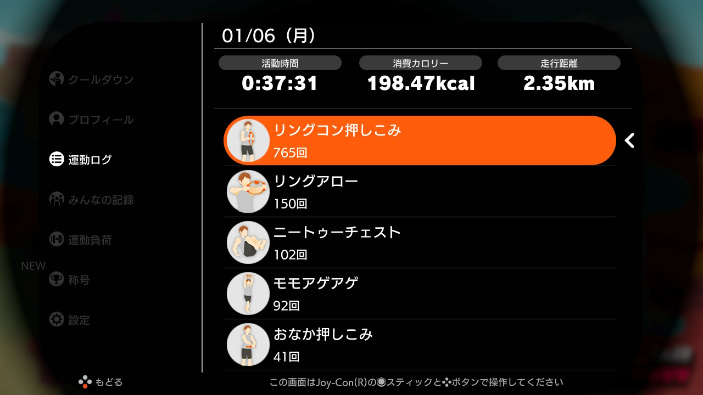

# Log 2020/01  

2020年1月3日から、Nitendo Switch のリングフィットアドベンチャーに取り組みはじめました。  
運動ログの画面キャプチャと、体組成計のグラフをロギングしていきたいと思います。  
## １月  
### 1/13 (DAY 11/90)  
|リングフィットアドベンチャー|
|:--:|
|戦闘シーンのコツがわかってきた（攻撃力の高い全体攻撃を最初に使う）ので、スムースに進む一方、ちょっとワンパターンになりつつあるような気もするが、スキルセットをどんどん入れ替えていくので、全身くまなく動かせている。これまでいちいちマイクロSDカードから画面キャプチャデータを取っていたが、面倒くさくなって、スイッチ本体のアルバムからツイッターに投稿してそのデータを取ってくることにした。いい感じ。|
||
|エレコム ECLEAR|
|リングフィットとの組み合わせを、同日分から、翌朝分に変えようと思う。そのほうが組み合わせとしてしっくりくる。体重は微減、体脂肪率は微増。しかし筋肉痛と、回復のために脂肪燃焼している感覚がある。|
||
||
### 1/12 (DAY 10/90)  
|リングフィットアドベンチャー|
|:--:|
|順調にこなす。脂肪燃焼と筋肉増強と体幹強化のバランスがいいと感じる。体をひねったり、かがんだり、片足立ちストレッチしたりするときに、ぐらぐらふらついていたのが、ちょっとこらえられるようになってきた。|
||
|エレコム ECLEAR|
|200g増。昨日は１時間やったものの、昼ゴハンが外食でよく食べたのと、お菓子もそこそこつまんだので、想定の範囲内。たまにはいいだろう。体は引き続き軽い筋肉痛。回復日は設けなくていいのだろうか。ふと気づくと肩こりがまったくなくなっている。冬休みで回復したからかもしれないし、リングフィットのおかげかもしれない。いい傾向は続いている。|
||

### 1/11 (DAY 09/90)  
|リングフィットアドベンチャー|
|:--:|
|土曜日だったので昼間にやったが、夜も気が向いたので、もう１回やった。クリアしたワールドもよくみると達成率が100%でなく、よくみるとコースはクリアしているものの街の人の依頼をクリアしていないのだったので、これをコツコツクリアしておいた。左下の活動時間の表示が、ZRボタンを押すといろいろ切り替えられることがわかった。|
||
|エレコム ECLEAR|
|夜に運動して、寝て、朝起きて体重を計っているわけだけども、寝ている間も疲労回復のために体が燃えている感覚があり、脂肪が減ってきた感覚がある。これはごっそり減っているのでは？と期待して計ってみらた200gほどしか減っていなかった。まあそんなものか。しかしこれを継続することでしか減量はできないのだろうな。続けよう。|
||
|食べちゃった|
||
||
### 1/10 (DAY 08/90)  
|リングフィットアドベンチャー|
|:--:|
|コースを３つとミニゲームを２つぐらいやって、満足したので終了したが、ログを見ると２０分だった。スムージーを作る時間とかは加算されないのかもしれない。画面の左下に、活動時間や走行距離が表示されるのだけど、意図せず走行距離が表示されているとやめ時がわかりづらい。活動時間固定にできないものか。|
||
|エレコム ECLEAR|
|この取り組みを開始して１０日目、８０．９ｋｇ→７８．８５ｋｇだから２ｋｇ減。ながらく７３ｋｇぐらいだったことからするとまだまだだけど、やってることが間違っていない、このまま続ければよい、という感覚が持てて素直に嬉しい。リングフィットアドベンチャーと無線ＬＡＮ体組成計を教えてくれた友人に感謝。|
||

### 1/9 (DAY 07/90)  
|リングフィットアドベンチャー|
|:--:|
|コースを３つとミニゲームなどやって満足して終わったが、活動時間をみると26分で、目安にしている30分を超えていなかった。ゲームとしての攻略法がわかってきて、クリア時間が短くなってきたのもあると思う。攻撃力の高い全体攻撃からやる、とか。いろんな動きが追加されてきて、全身使うので体がほぐれる感覚がある。スクワット系が効いてじんわりと全身が筋肉痛だが、不快ではなくむしろ心地よい。|
||
|エレコム ECLEAR|
|体重が一進一退。体脂肪率がちょっとさがった。とはいえいずれもまだ誤差の範囲かな。筋肉が疲労していて、空腹感がある。|
||

### 1/8 (DAY 06/90)  
|リングフィットアドベンチャー|
|:--:|
|やる分量として、コースを３つぐらいやるとちょうど３０分ぐらいということがわかってきた。（ワールドのなかに点在している通過ポイントのことね。）「今日はこれぐらいにしますか？」というのも、コースが終わるたびに聞いてきているようだ。|
||
|エレコム ECLEAR|
|体重がちょっと戻ってしまった。しかしリングフィットやるとめちゃくちゃ喉が乾くので、お茶や水をガブガブ飲んだため、それを考えるとまあこんなもんだろう。なにより体が締まってきた感覚があるので、筋肉が増えてきているのもあるかもしれない。無駄な間食をやめようというモチベーションにもなる。|
||
### 1/7 (DAY 05/90)  
|リングフィットアドベンチャー|
|:--:|
|昨日から「３０分を超えて、最初のセーブポイント（「ここまでにしますか？」）で終わることにしたら、ちょうどよかった。ワールド４はそれで２日間でようやくラストステージのひとつ手前まで行った。これ１日でやるのはかなりキツいから、早晩１日１ワールドは破綻していただろう。|
||
|友人に「サイレントモードを試してみ」と言われて一時的に試してみた。足踏み・もも上げの代わりに軽い屈伸をする。負荷がやや軽いが、足の裏の衝撃がないので快適。軽めにしたい日にはこっちでいいなと思った。|
||
|エレコム ECLEAR|
|体重こそ昨日と同じだけども、軽い筋肉痛というか、疲労が残っており、空腹感もあって、体が燃えている感あり。脂肪燃焼している状態なのだろう。これまでは食間でも空腹感があるとスナック菓子などを食べてしまっていたが、今は空腹感があってもそれほどなにか食べたいと思わない。|
||
### 1/6 (DAY 04/90)  
|リングフィットアドベンチャー|
|:--:|
|１日１ワールドだとちょっとオーバーワークだったので、３０分超えて最初の「今日はこれぐらいにしておきますか？」で終わることにした。生活のなかで時間の確保も課題だ。また強度も2下げてもらった。これでちょうどよかった。|
||
||
|エレコム ECLEAR|
|スクワットが効いて、ももに疲労が残っている感じ。しかし嫌な感覚ではなく、スイッチが入ってエンジンがかかって体が燃えてるように感じる。|
||
### 1/5 (DAY 03/90)  
|リングフィットアドベンチャー|
|:--:|
|さらに強度を4あげてみた。汗をかくので、入浴後は無理。夕食後すぐもつらい。いつやるか問題。しかし、とりあえず90日間、と思って１日１ワールドやっているが、長すぎな気がする。途中で何度か「今日はこれぐらいにしておきますか？」と聞かれるのだけど、そこでやめるのが適正な気もする。|
||
|エレコム ECLEAR|
|なんとか80kg を切った。いやいや、一時的に水分が抜けただけ。|
||
### 1/4 (DAY 02/90)  
|リングフィットアドベンチャー|
|:--:|
|いちびってたら強度を４上げられました。|
||
|エレコム ECLEAR|
|起き抜けは80kg を切っていたものの、食べて飲んだら揺り戻し。じっくり行こう。|
||
### 1/3 (DAY 01/90)  
|リングフィットアドベンチャー|
|:--:|
|キャプチャしたつもりが撮れていませんでした。なかなか楽しい。|
|image not available|
|エレコム ECLEAR|
|80kg を超えており自分でびっくり。|
||