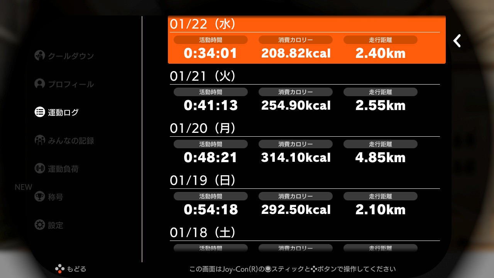

# Log 2020/01  

2020年1月3日から、Nitendo Switch のリングフィットアドベンチャーに取り組みはじめました。  
運動ログの画面キャプチャと、体組成計のグラフをロギングしていきたいと思います。  

2020年|1月
--|--
リングフィットアドベンチャー|エレコム ECLEAR
1/31|DAY 29/90
|強度はまあまあ。ももあげとか足踏みとかが脈あがる。もうちょっと体が絞れてきたら、ちょっと強度を上げてもいいかな。筋肉痛がそれほどではなくなってきた。|思ったほどは落ちていなかった。７８ｋｇの壁がなかなか手強い。|
1/30|DAY 28/90  
普通のバトルはコツがわかってきて負荷が物足りないかな、と思いきや、ちょこちょこ挟まれるラッシュとかミッションがちょうどよく脈が上がる。無理はせず強度はキープしている。２周目とかになったら、強度を上げてもいいかもしれない。|リングフィットでだんだん体が締まってきているのは感じているが、体重はそこまで落ちているわけでもない。しかし、大盛りやおかわりをしたり、お菓子を食べるのを、かなり意識してセーブするようになった。飢餓状態は逆に良くないらしいから、腹八分目ぐらいで、適度に間食もして、と意識ができるようになった。
1/29|DAY 27/90
やってるときは軽々とやっているつもりだったが、風呂上がりは筋肉疲労でぐったりしていた。強度あげようかとちょっと思っていたけどキープにしてよかった。|またぶり返し、気分転換にちょっと多く飲食したので、納得。如実に出るものだ。
1/28|DAY 26/90
リングフィットやるのが生活習慣になりつつある。筋肉痛もそれほど気にならなくなってきた。慣れてきたからか、プロテインを飲んでいるからか、その両方かはわからない。ダメージを受けなくなってきたので、しっかりやれている。しかしヨガ系の片足で立つやつは全然できない。|ぶり返しを反省して、食べる量を気にして生活した。しかし改めて体が重くなった、贅肉で可動域がせばまっていたのだなぁ、と実感。絞りこみたい。
1/27|DAY 25/90
スキルセットがたまたまスクワット系がない状態になっていたので、活動時間としてはそこそこあるがやっていて割と負荷が軽いと感じていた。キツイと感じるのはスクワット系、脈拍が上がるのは押し込みながらももあげとか。ストーリーモードじゃないのもやってみてもいいかもしれない。|喉が乾いてガブガブ飲んだが、横ばいだった。体重が落ちなくなってきているような気もするが、腹回りとかは確実に締まってきている。生活習慣は確実に改善されているので、まあ一喜一憂はしないでおこう。
1/26|DAY 24/90
日曜なので昼間にやる。慣れてきたのか、強度が足りないかもしれない。しかし強度を上げると続くだろうか。模索は続く。|さらにぶり返し。土日はどうしても食べすぎるのか。
1/25|DAY 23/90
|
1/24|DAY 22/90
筋肉痛がひどいが、１日休むとペースが崩れそうで、休養日を取る勇気がない。大きい筋肉は休まなくても大丈夫らしいから、スクワット中心に軽めにやる、というのもいいかもしれない。しかし始めたころに比べて体が動くようになった。片足でも立てるようになってきた。まだまだ体が重いけど。|ちょっとぶり返し。セーブはしたつもりだが、少し食べすぎたか。しかし腹回りはかなり絞れてきた。まだ服越しに他人が気づくほどではないけれど、かがむ時などに、つっかえなくなってきた。燃えろ！おれのコスモ！
1/23|DAY 21/90
淡々とやれるようになってきた。始めた頃はバテバテで汗だくで「うぉー」とか声が出ていた。フォームとかもよくなってきたと思う。ジャンプ操作（下に向けて押し込む）だけがなかなかうまくできない。活動時間は35分となっているが、スムージーを絞ったり設定を変えたりしている時間も含めると、だいたい１時間やっている。こうなるとほかのことをする時間はなかなか取れないのだけど、ジムに通うことを考えたら、移動時間とか着替え時間が要らないのは素晴らしい。|やっと78kgを切ってきた。BMIが標準になるには、73kgを切らないといけない。もともと、ながらく73kgぐらいだったから、そこはなんとしても達成したい。最適は22らしいが、それには63kgにならないといけない。これは、20歳ぐらいの時の体重だ。いまのルーチン（夜リングフィット、ザバス飲む、風呂って寝る、朝トイレ行き体組成計載る、ザバス飲む、体重グラフをGitHubにあげる）を続ければ不可能ではないかもしれない。がんばろう。
1/22|DAY 20/90
今日もがんばった。ギター教室の日だったので、帰ってきた時点で２０：３０ぐらいだったので、子どもたちと会話する時間がほとんど取れなかった。あと70日、もしくは目に見えてシェイプアップできるまでは許して・・・|食べることに関してかなりコントロールできている。ザバスを飲むタイミングについて、夜のリングフィット後、あとは風呂に入って寝るだけ、の際と、翌朝の起き抜けすぐ、の１日２回飲むことにした。これでしばらく様子を見てみようと思う。目的は筋肉痛の緩和、回復。リングフィットを始めてから、常に筋肉痛という感じ。本当は１日おきとか、休養日を設けてもいいのかもしれないが、それをやると途絶えてしまいそうで怖い。そういう意味では、軽めに済ませる日を設けてもいいのかもしれない。
1/21|DAY 19/90
今日もしっかりめにできた。300kcal超えるまで・・・というのは日常生活では時間の確保がなかなか難しい。活動時間にしても消費カロリーにしても、あくまで目安だな。|昨日からすると50g増えている。ジュース１本、お菓子ひと袋食べるのも、この50g単位の体組成計での記録に反映される、と意識が変わった。体脂肪率は確実に落ちてきている。いまちょうど体脂肪率の「高い」と「標準」の境目（２４％）にあるのだな。BMIと内蔵脂肪も「標準」に持っていきたい。アミノバイタルを買い足すとき、ふとザバスが気になったので、合わせて買ってきた。さっそく牛乳に溶かして飲んでみたら、美味しいし、飲みごたえがあった。
1/20|DAY 18/90
平日だがちょっとがんばった。300kcalを目安にしてもいいかもしれない。子どもたちが観戦しており、魔物をどんどん倒すのを見て「パパ強い！」と喜んでくれる。パパの威信回復にもいいのかもしれない。|お菓子はちょっとつまんだが、スムージーを朝の１本だけにセーブ。いままでで一番絞れてきた。意識すれば反映される。
1/19|DAY 17/90
今日も日曜日で時間があったので、ちょっと頑張った。毎日汗だくに運動するという習慣がついたのはすばらしい。子どもたちもリングフィットをやりたがり、時間調整が大変だが、パパ痩せてきたよ！と褒めてくれるので、頑張れる。|体重は変わらないが、体脂肪率が落ちてきている。体が締まってきた感覚があり、動きやすくなってきた。体幹も強くなって、片足立ちなどでふらつきが減ったと思う。ちょっとスムージーを飲みすぎたり、おやつをつまんだりしたので、無駄に食べないよう、適正量を模索していきたい。
1/18|DAY 16/90
土曜日で時間があったので、みっちり１時間やった。リングを頭の後ろでプッシュするやつがキツくてかなりキた。よく考えられているなぁ。|400g増えちゃった。お昼が外食で生中いった。子どもたちがプリン食べたいというのでコンビニで買食いした。筋肉疲労感が緩和するかな、とスムージーを２、３本飲んだ。まあ、たまにはね。それでも以前に比べれば自制が効いている。
1/17|DAY 15/90
リングフィットあるある。バンザイコシフリで楽しがち。アミノバイタルを、朝とリングフィットの前とに飲んでる。慣れてきたのもあるのかだいぶ筋肉痛がましになったが、痛いのは痛い。しかし嫌な痛みではなく、体が変わっていっている感覚がある。片足立ち系がだいぶできるようになってきたり、しゃがむ時にお腹がつっかえなくなってきたり。アミノバイタル併用はいまの箱がカラになってももう１箱ぐらいは続けたい。|昨日より50g増えてる。２個食べたウイスキーボンボンか？夜中に喉が痛くて飲んだヤクルト１本か？ちょっと残ってたコップ１杯の獺祭か？まだまだいろいろ食べちゃってるなぁ。
1/16|DAY 14/90
フィットスキルの使いこなしがわかってきて、体もなれてきて、ちょっと飽きがきそうな感じ。楽めで攻撃力の強い全体攻撃を選択しがち。１ターンで敵が半分ぐらいになって、２ターンの途中で終わる感じ。左右入れ替えしないうちに終わったり。ゲーム要素はもっと少なく、言われたとおりの動作をするのでもいいのではないかと思った。そういう場合はセットを使うのかなぁ。試行錯誤。|始めたときは80kg台だったのが、２週間でようやく７８ｋｇ台になった。１ヶ月５％まで、というのが目安らしいので、いい感じだ。１ヶ月で４ｋｇ落とせれば御の字だ。リングフィットがやや軽めかな？というのと、ちょっとお菓子を食べたり、スムージーやヤクルトを飲んだりしたので、どうかなと思ったが、順調に落ちている。疲労感からすると、アミノバイタルを飲んでもそこそこ疲労感があるので、充分な強度があったようだ。
1/15|DAY 13/90
スクワットが、始めた頃は数回でももの筋肉が千切れそうにきつかったが、慣れてきたのか、深くしっかりキープしてやりきれるようになった。腹筋系も、動きの邪魔になっていたお腹のお肉が減ったのか、動作しやすくなってきた。いい感じ。もうちょっとやりたかったが、きりのいいところで終了した。|１食外食だったり、スムージーが美味しくて３本飲んだりしてしまったが、リバウンドしていなくて安心。脂肪1kg燃焼には2,700kcal必要らしい。１日240kcalを1ヶ月とか、とのこと。道のりは遠いな・・・しかし継続できているので、このまま続けよう。
1/14|DAY 12/90
いろいろわかってきた。運動時間は正味フィットスキルをやってる時間しかカウントされないようだ。村人の話を聞いたり買い物したりしてる間、タイマーは止まっている。あと、ワールドのボス戦が終わってから、村人のミッションが現れるとかあるし、はてなマークのミッションは出し方がわからない。２周目用だろうか。今日は軽めにやったつもりだが、もも筋がかなり疲労している。|ちょっとお菓子をつまんだりしたが、体重は少し減っていたので、許容範囲か。かつてよりダラダラ食べることはなくなった。体重自体はほとんど変わっていないのだけど、風呂の鏡などでみると、締まってきた気がする。
1/13|DAY 11/90
戦闘シーンのコツがわかってきた（攻撃力の高い全体攻撃を最初に使う）ので、スムースに進む一方、ちょっとワンパターンになりつつあるような気もするが、スキルセットをどんどん入れ替えていくので、全身くまなく動かせている。これまでいちいちマイクロSDカードから画面キャプチャデータを取っていたが、面倒くさくなって、スイッチ本体のアルバムからツイッターに投稿してそのデータを取ってくることにした。いい感じ。|リングフィットとの組み合わせを、同日分から、翌朝分に変えようと思う。そのほうが組み合わせとしてしっくりくる。体重は微減、体脂肪率は微増。しかし筋肉痛と、回復のために脂肪燃焼している感覚がある。
1/12|DAY 10/90
順調にこなす。脂肪燃焼と筋肉増強と体幹強化のバランスがいいと感じる。体をひねったり、かがんだり、片足立ちストレッチしたりするときに、ぐらぐらふらついていたのが、ちょっとこらえられるようになってきた。|200g増。昨日は１時間やったものの、昼ゴハンが外食でよく食べたのと、お菓子もそこそこつまんだので、想定の範囲内。たまにはいいだろう。体は引き続き軽い筋肉痛。回復日は設けなくていいのだろうか。ふと気づくと肩こりがまったくなくなっている。冬休みで回復したからかもしれないし、リングフィットのおかげかもしれない。いい傾向は続いている。
1/11|DAY 09/90
土曜日だったので昼間にやったが、夜も気が向いたので、もう１回やった。クリアしたワールドもよくみると達成率が100%でなく、よくみるとコースはクリアしているものの街の人の依頼をクリアしていないのだったので、これをコツコツクリアしておいた。左下の活動時間の表示が、ZRボタンを押すといろいろ切り替えられることがわかった。|夜に運動して、寝て、朝起きて体重を計っているわけだけども、寝ている間も疲労回復のために体が燃えている感覚があり、脂肪が減ってきた感覚がある。これはごっそり減っているのでは？と期待して計ってみらた200gほどしか減っていなかった。まあそんなものか。しかしこれを継続することでしか減量はできないのだろうな。続けよう。
1/10|DAY 08/90
コースを３つとミニゲームを２つぐらいやって、満足したので終了したが、ログを見ると２０分だった。スムージーを作る時間とかは加算されないのかもしれない。画面の左下に、活動時間や走行距離が表示されるのだけど、意図せず走行距離が表示されているとやめ時がわかりづらい。活動時間固定にできないものか。|この取り組みを開始して１０日目、８０．９ｋｇ→７８．８５ｋｇだから２ｋｇ減。ながらく７３ｋｇぐらいだったことからするとまだまだだけど、やってることが間違っていない、このまま続ければよい、という感覚が持てて素直に嬉しい。リングフィットアドベンチャーと無線ＬＡＮ体組成計を教えてくれた友人に感謝。
1/9|DAY 07/90
コースを３つとミニゲームなどやって満足して終わったが、活動時間をみると26分で、目安にしている30分を超えていなかった。ゲームとしての攻略法がわかってきて、クリア時間が短くなってきたのもあると思う。攻撃力の高い全体攻撃からやる、とか。いろんな動きが追加されてきて、全身使うので体がほぐれる感覚がある。スクワット系が効いてじんわりと全身が筋肉痛だが、不快ではなくむしろ心地よい。|体重が一進一退。体脂肪率がちょっとさがった。とはいえいずれもまだ誤差の範囲かな。筋肉が疲労していて、空腹感がある。
1/8|DAY 06/90
やる分量として、コースを３つぐらいやるとちょうど３０分ぐらいということがわかってきた。（ワールドのなかに点在している通過ポイントのことね。）「今日はこれぐらいにしますか？」というのも、コースが終わるたびに聞いてきているようだ。|体重がちょっと戻ってしまった。しかしリングフィットやるとめちゃくちゃ喉が乾くので、お茶や水をガブガブ飲んだため、それを考えるとまあこんなもんだろう。なにより体が締まってきた感覚があるので、筋肉が増えてきているのもあるかもしれない。無駄な間食をやめようというモチベーションにもなる。
1/7|DAY 05/90
昨日から「３０分を超えて、最初のセーブポイント（「ここまでにしますか？」）で終わることにしたら、ちょうどよかった。ワールド４はそれで２日間でようやくラストステージのひとつ手前まで行った。これ１日でやるのはかなりキツいから、早晩１日１ワールドは破綻していただろう。|友人に「サイレントモードを試してみ」と言われて一時的に試してみた。足踏み・もも上げの代わりに軽い屈伸をする。負荷がやや軽いが、足の裏の衝撃がないので快適。軽めにしたい日にはこっちでいいなと思った。|体重こそ昨日と同じだけども、軽い筋肉痛というか、疲労が残っており、空腹感もあって、体が燃えている感あり。脂肪燃焼している状態なのだろう。これまでは食間でも空腹感があるとスナック菓子などを食べてしまっていたが、今は空腹感があってもそれほどなにか食べたいと思わない。
1/6|DAY 04/90
１日１ワールドだとちょっとオーバーワークだったので、３０分超えて最初の「今日はこれぐらいにしておきますか？」で終わることにした。生活のなかで時間の確保も課題だ。また強度も2下げてもらった。これでちょうどよかった。|スクワットが効いて、ももに疲労が残っている感じ。しかし嫌な感覚ではなく、スイッチが入ってエンジンがかかって体が燃えてるように感じる。
1/5|DAY 03/90
さらに強度を4あげてみた。汗をかくので、入浴後は無理。夕食後すぐもつらい。いつやるか問題。しかし、とりあえず90日間、と思って１日１ワールドやっているが、長すぎな気がする。途中で何度か「今日はこれぐらいにしておきますか？」と聞かれるのだけど、そこでやめるのが適正な気もする。|なんとか80kg を切った。いやいや、一時的に水分が抜けただけ。
1/4|DAY 02/90
いちびってたら強度を４上げられました。|起き抜けは80kg を切っていたものの、食べて飲んだら揺り戻し。じっくり行こう。
1/3|DAY 01/90
キャプチャしたつもりが撮れていませんでした。なかなか楽しい。|80kg を超えており自分でびっくり。  
  
2020年|1月
--|--
リングフィットアドベンチャー|エレコム ECLEAR

